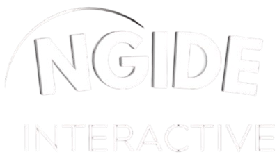

# Ngide Interactive

<div align="center">
  
  
  **Independent game studio building atmospheric worlds at the edge of signal and silence.**
  
  [Live Demo](#) · [Report Bug](#) · [Request Feature](#)
</div>

---

## 🚀 About

Ngide Interactive is an independent game development studio based in Depok, Indonesia. We create atmospheric, systems-driven games that explore solitude, strange machinery, and human choices.

### Current Project: Deep Space Echo

Our first transmission — a narrative systems game about maintaining a failing listening station beyond mapped space, decoding distant signals, and deciding which voices deserve an answer.

---

## ✨ Features

- **Immersive Space Theme**: Deep space aesthetic with film grain effects and atmospheric design
- **Custom Cursor Experience**: Interactive cursor that responds to content and hover states
- **Smooth Animations**: Scroll-triggered animations and smooth transitions throughout
- **Responsive Design**: Optimized for desktop and mobile viewing
- **Supporting Pages**: Custom 404, maintenance, and coming-soon pages with consistent theming

---

## 🛠️ Tech Stack

- **Framework**: React 19 + TanStack Start
- **Styling**: Tailwind CSS v4 with custom design system
- **Routing**: TanStack Router
- **State Management**: TanStack Query
- **UI Components**: Radix UI primitives
- **Build Tool**: Vite
- **TypeScript**: Full type safety

---

## 📦 Installation

```bash
# Clone the repository
git clone https://github.com/Budibudian17/ngideinteractive.git
cd ngideinteractive

# Install dependencies
npm install

# Start development server
npm run dev

# Build for production
npm run build

# Preview production build
npm run preview
```

---

## 🎨 Design System

The project uses a custom color palette based on OKLCH color space for consistent theming:

- **Background**: Deep space charcoal (`oklch(0.105 0 0)`)
- **Foreground**: Stark white (`oklch(0.955 0.006 85)`)
- **Accent**: Muted highlights for interactive elements
- **Typography**: Space Grotesk (display), DM Sans (body), DM Mono (technical)

---

## 📁 Project Structure

```
src/
├── components/          # React components
│   ├── ui/             # Reusable UI components
│   ├── Error404.tsx    # Custom 404 page
│   ├── MaintenancePage.tsx  # Maintenance page
│   ├── ComingSoonPage.tsx   # Coming soon page
│   └── ...
├── hooks/              # Custom React hooks
│   ├── useCustomCursor.ts
│   └── useScrollAnimation.ts
├── routes/             # TanStack Router routes
├── lib/                # Utility functions
└── styles.css          # Global styles and Tailwind config
```

---

## 🌐 Pages

- **Home** (`/`) - Main landing page with hero, philosophy, projects, and studio sections
- **Error 404** (`/error-404`) - Custom not found page with space theme
- **Maintenance** (`/system-maintenance`) - System maintenance page
- **Coming Soon** (`/project-coming-soon`) - Future project announcements

---

## 🤝 Contributing

Contributions, issues, and feature requests are welcome! Feel free to check [issues page](../../issues).

---

## 📧 Contact

- **Email**: ngideinteractive@gmail.com
- **Location**: Depok, Indonesia
- **Coordinates**: 6.4025° S, 106.8188° E

---

## 📄 License

This project is proprietary. All rights reserved © 2024 Ngide Interactive.

---

<div align="center">
  <sub>Built with ❤️ by Ngide Interactive</sub>
</div>
